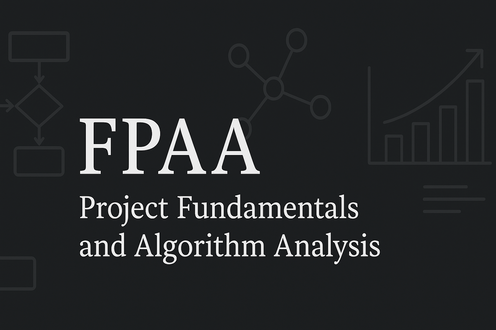

---

---

# Fundamentos de Projetos e Análise de Algoritmos

Repositório dedicado aos estudos da disciplina de Fundamentos de Projeto e Análise de Algoritmos, lecionada pelo Prof. [João Paulo Aramuni](https://github.com/joaopauloaramuni) do curso de Engenharia de Software da PUC Minas.

## Trabalhos

Os trabalhos avaliativos estão organizados, individualmente, em seus respectivos subdiretórios:

- [Trabalho individual 1 (Karatsuba)](/trabalhos/Trabalho%20individual%201/)
- [Trabalho individual 2 (Max-Min Selector)](/trabalhos/Trabalho%20individual%202/)
