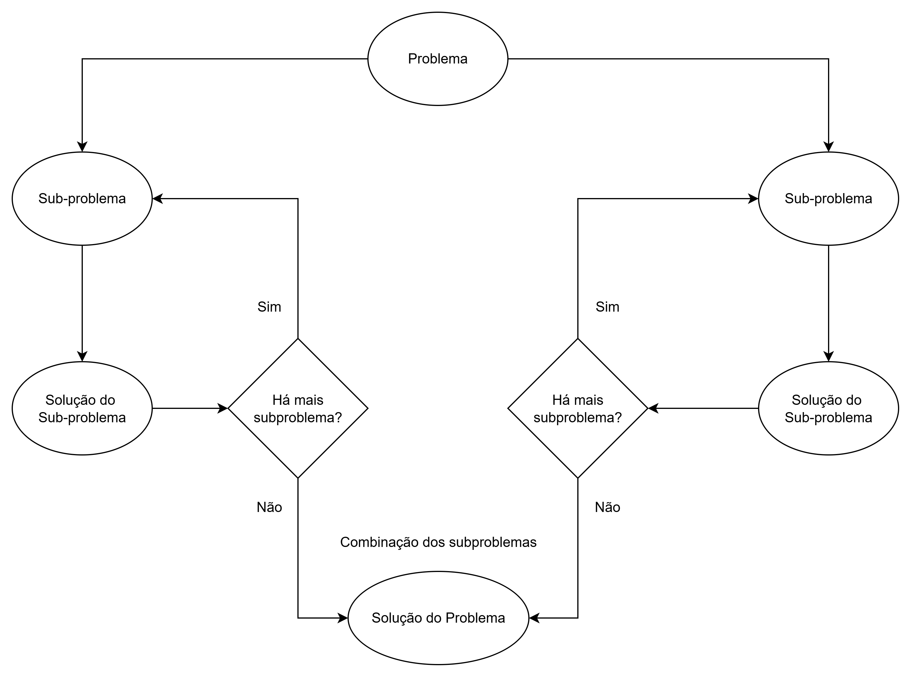

# MaxMin Select — Divisão e Conquista

Este documento contém os arquivos do projeto pedidos na disciplina:

- `main.py` — implementação em Python do algoritmo **MaxMin Select** usando divisão e conquista.
- `README``.md` — instruções de execução, explicação detalhada (linha a linha) e relatório técnico com a análise de complexidade (contagem de comparações e aplicação do Teorema Mestre).

---

## Estrutura do repositório

```
└───Trabalho individual 2
    │   README.md
    │
    ├───code
    │       main.py
    │
    └───docs
        └───statement
                Trabalho individual 2 - Valor 10 pontos.pdf
```

---

## main.py

```python
#!/usr/bin/env python3
"""
main.py

Implementação do algoritmo MaxMin Select (divisão e conquista).
Retorna o menor, o maior e a quantidade de comparações realizadas.

Uso:
  python3 main.py 3 1 4 2
  python3 main.py --random 10
"""

import argparse
import random
import sys
from typing import List, Tuple


def maxmin_divide_conquer(arr: List[float], left: int, right: int) -> Tuple[float, float, int]:
    """
    Função recursiva que retorna (min, max, comparações) para arr[left:right+1].

    Base cases:
    - se left == right: um elemento, 0 comparações
    - se right == left + 1: dois elementos, 1 comparação

    Caso geral: divide o segmento em duas metades, resolve recursivamente e
    combina os resultados com 2 comparações (uma para os máximos e outra para
    os mínimos).
    """
    # Caso com um elemento
    if left == right:
        return arr[left], arr[left], 0

    # Caso com dois elementos
    if right == left + 1:
        # apenas 1 comparação para definir min e max
        if arr[left] <= arr[right]:
            return arr[left], arr[right], 1
        else:
            return arr[right], arr[left], 1

    # Caso geral: dividir em duas metades
    mid = (left + right) // 2

    min1, max1, c1 = maxmin_divide_conquer(arr, left, mid)
    min2, max2, c2 = maxmin_divide_conquer(arr, mid + 1, right)

    comparisons = c1 + c2

    # Combinar: 1 comparação para os máximos e 1 para os mínimos
    # comparar máximos
    comparisons += 1
    if max1 >= max2:
        overall_max = max1
    else:
        overall_max = max2

    # comparar mínimos
    comparisons += 1
    if min1 <= min2:
        overall_min = min1
    else:
        overall_min = min2

    return overall_min, overall_max, comparisons


def maxmin(arr: List[float]) -> Tuple[float, float, int]:
    """
    Wrapper que valida entrada e chama a função recursiva.
    Retorna (min, max, comparisons).
    """
    n = len(arr)
    if n == 0:
        raise ValueError("A sequência não pode ser vazia")
    return maxmin_divide_conquer(arr, 0, n - 1)


def parse_args() -> argparse.Namespace:
    p = argparse.ArgumentParser(description="MaxMin Select (divisão e conquista)")
    p.add_argument("values", nargs="*", help="lista de números (ex: 3 1 4 2)")
    p.add_argument("--random", "-r", type=int, help="gera n números aleatórios")
    p.add_argument("--seed", type=int, default=None, help="seed para gerador aleatório")
    return p.parse_args()


def main() -> int:
    args = parse_args()

    if args.random is not None:
        if args.random <= 0:
            print("--random deve ser um inteiro positivo")
            return 1
        if args.seed is not None:
            random.seed(args.seed)
        arr = [random.randint(-1000, 1000) for _ in range(args.random)]
    elif args.values:
        try:
            arr = [float(x) for x in args.values]
        except ValueError:
            print("Todos os valores devem ser números")
            return 1
    else:
        # leitura interativa se nenhum argumento for passado
        print("Forneça números como argumentos ou use --random N. Exemplo: python3 main.py 3 1 4 2")
        return 0

    print("Sequência:", arr)
    minimum, maximum, comps = maxmin(arr)
    print(f"Menor: {minimum}")
    print(f"Maior: {maximum}")
    print(f"Comparações realizadas: {comps}")

    # Verificação simples (checar com min()/max() do Python)
    assert minimum == min(arr), "Min incorrect"
    assert maximum == max(arr), "Max incorrect"

    return 0


if __name__ == "__main__":
    sys.exit(main())
```

---

# MaxMin Select — Divisão e Conquista

## Descrição do projeto

Este projeto implementa o algoritmo **MaxMin Select** usando a técnica de
divisão e conquista. Dada uma sequência de números, o algoritmo retorna o
menor e o maior valor presentes na sequência, bem como a quantidade de
comparações realizadas.

A versão implementada divide recursivamente a sequência em duas metades,
resolve cada metade e combina os resultados com duas comparações (uma para
comparar os máximos das metades e outra para comparar os mínimos). As
condições base tratam segmentos de tamanho 1 e 2, com custo 0 e 1
comparações, respectivamente.

> Observação: existe uma estratégia alternativa chamada "parwise comparison"
> (comparação em pares) que pode reduzir o número total de comparações para
> aproximadamente `3*floor(n/2)` (ou `1.5n`), mas a implementação pedida na
> disciplina solicita explicitamente a abordagem de divisão e conquista
> recursiva.

### Diagrama de Recursão (MaxMin Select)

O algoritmo MaxMin Select divide recursivamente a sequência em subproblemas menores,
combinando os resultados até encontrar o **menor e maior elemento**.

Abaixo, a árvore de recursão ilustra o processo:




## Como executar o projeto

1. Tenha Python 3.8+ instalado.
2. Clone ou copie os arquivos `main.py` e `README.md` para um diretório.
3. Execute exemplos:

```bash
python main.py 3 1 4 2
python main.py --random 10 --seed 42
```

O programa imprime a sequência, o menor, o maior e a quantidade de
comparações realizadas. O arquivo `main.py` também possui asserts que
verificam o resultado usando as funções `min()` e `max()` do Python.


## Explicação do algoritmo (linha a linha)

Abaixo segue uma explicação detalhada das partes principais do `main.py`:

1. **Cabeçalho e imports**
   - `argparse` — para ler argumentos de linha de comando.
   - `random` — para gerar sequência aleatória quando solicitado.
   - `sys` — para retornar códigos de saída.
   - `typing.List, Tuple` — anotações de tipo.

2. **`maxmin_divide_conquer(arr, left, right)`**
   - Recebe a lista e os índices `left` e `right` que definem o subvetor a
     ser processado.
   - **Caso base 1**: `left == right` — há apenas um elemento; retorna
     `(arr[left], arr[left], 0)` (0 comparações).
   - **Caso base 2**: `right == left + 1` — dois elementos; faz-se uma
     comparação para decidir `min` e `max`, retornando também `1` como
     contador de comparações.
   - **Caso geral**:
     - Calcula `mid = (left + right) // 2`.
     - Chama recursivamente para a esquerda: `min1, max1, c1`.
     - Chama recursivamente para a direita: `min2, max2, c2`.
     - Soma as comparações das subchamadas: `comparisons = c1 + c2`.
     - Compara `max1` e `max2` (1 comparação) para obter `overall_max`.
     - Compara `min1` e `min2` (1 comparação) para obter `overall_min`.
     - Retorna `(overall_min, overall_max, comparisons)`.

3. **`maxmin(arr)`**
   - Valida que a sequência não é vazia e chama o wrapper recursivo
     `maxmin_divide_conquer(arr, 0, n-1)`.

4. **Funções de utilidade / CLI**
   - `parse_args()` — define os argumentos `values`, `--random/-r` e
     `--seed`.
   - `main()` — monta a sequência de entrada com base nos argumentos e
     imprime os resultados.


## Relatório técnico — análise de complexidade

### Contagem de comparações (método direto)

Definimos `C(n)` como o número de comparações realizadas pelo algoritmo
maxmin sobre uma sequência de tamanho `n`.

- Casos base:
  - `C(1) = 0` (nenhuma comparação necessária)
  - `C(2) = 1` (uma comparação para decidir min e max)

- Caso geral (divisão em duas metades de tamanho aproximadamente `n/2`):

  Ao dividir a sequência em duas metades e resolver recursivamente, temos:

    $$
    C(n) = C(\lfloor n/2 \rfloor) + C(\lceil n/2 \rceil) + 2
    $$

  O `+2` corresponde às duas comparações de combinação: uma para os
  máximos e outra para os mínimos.

  Se `n` for potência de 2 (mais simples para análise), escrevemos
  `n = 2^k`. Definindo `D(k) = C(2^k)` obtemos a recorrência:

  $$ D(k) = 2D(k-1) + 2, \quad D(0) = 0 $$

  Resolve-se esta recorrência por resolução homogênea + particular:

  - Solução homogênea: $$ (D_h(k) = A \cdot 2^k\ $$
  - Procura-se uma solução particular constante \(B\):
    $$ B = 2B + 2 \Rightarrow B = −2 $$
  - Soma: $$ D(k) = A\cdot 2^k - 2 $$
  - Usando $$ D(0)=0 $$
    - temos $$ A=2 $$ 
      - portanto
        $$ D(k) = 2^{k+1} - 2 $$

  Voltando para `n=2^k`, temos:

  $$ C(n) = 2n - 2, \quad n = 2^k $$

  Para `n` geral (não necessariamente potência de 2), pode-se provar por
  indução que

  $$ C(n) \le 2n - 2 \quad \text{para } n\ge 2 $$

  Assim, o número de comparações cresce linearmente em `n`.

  **Exemplos numéricos**:
  - `n = 1` -> `C(1) = 0`.
  - `n = 2` -> `C(2) = 1`.
  - `n = 4` -> `C(4) = 6 = 2*4 - 2`.


### Aplicação do Teorema Mestre

Considere a recorrência assintótica para o tempo total (ou número de
operações relevantes) `T(n)`:

$$ T(n) = 2T\left(\frac{n}{2}\right) + O(1) $$

Identificamos:

- `a = 2` (número de subproblemas)
- `b = 2` (fator de divisão do tamanho)
- `f(n) = O(1)` (custo de combinar resultados)

Calculamos \(p = \log_b a = \log_2 2 = 1\).

Comparando `f(n)` com `n^p = n^1 = n`:

$$ f(n) = O(1) = O(n^{1-\varepsilon}) $$ para $$ \varepsilon = 1 $$

Portanto, estamos no **Caso 1 do Teorema Mestre**, o que implica:

$$ T(n) = \Theta(n^{\log_b a}) = \Theta(n). $$

Isso confirma que a complexidade temporal assintótica do algoritmo é
linear em `n`.


### Observações sobre otimalidade

- A implementação recursiva por divisão e conquista apresentada tem custo
  em comparações $$ C(n) \le 2n - 2 $$
- Existe uma técnica alternativa (comparações em pares) que reduz o
  número de comparações para $$ 3*\lfloor n/2 \rfloor $$ (~ `1.5n`) e é
  preferível quando o objetivo é minimizar o número de comparações.
- Contudo, tanto a abordagem recursiva quanto a de pares possuem complexidade
  temporal assintótica $$ \Theta(n) $$ a diferença está apenas em constantes.


## Conclusão

- O algoritmo implementado resolve o problema de obter mínimo e máximo
  em tempo linear, utilizando divisão e conquista.
- A contagem exata de comparações para `n` (potência de 2) é `2n - 2`.
- Pelo Teorema Mestre, $$ T(n) = \Theta(n) $$


## Referências (recomendadas)

- Aula: _Análise de complexidade de algoritmos_ (disponível no material da
  disciplina).
- Livro clássico: Cormen, Leiserson, Rivest, Stein — *Introduction to
  Algorithms* (seção sobre análise de algoritmos e teorema mestre).

